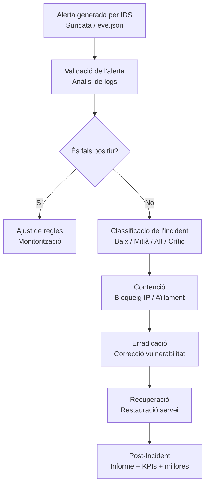

# Pla de Resposta a Incidents

## 1. Objectiu

Aquest document defineix el procediment estructurat de resposta davant incidents de seguretat detectats pel sistema IDS/IPS basat en Suricata.

Els objectius principals són:

- Detectar incidents de manera ràpida i fiable
- Reduir l’impacte sobre els sistemes
- Preservar evidències
- Garantir la recuperació segura
- Aplicar millora contínua

---

## 2. Classificació d’Incidents

Els incidents es classifiquen segons la seva criticitat:

| Nivell | Descripció | Exemple | Acció |
|--------|------------|----------|--------|
| **Baix** | Activitat sospitosa sense impacte directe | Escaneig de ports (Nmap) | Monitorització |
| **Mitjà** | Intent d’explotació sense compromís | Força bruta SSH | Bloqueig temporal |
| **Alt** | Intent amb possible impacte real | SQL Injection detectada | Bloqueig immediat + revisió servei |
| **Crític** | Compromís confirmat | Accés no autoritzat a BD | Aïllament node + notificació urgent |

---

## 3. Procés de Resposta a Incidents

El procés segueix el model estàndard:

1. Detecció  
2. Anàlisi  
3. Contenció  
4. Erradicació  
5. Recuperació  
6. Post-incident  

---

## 4. Diagrama de Flux

---

## 5. Fases del Procés

### 5.1 Detecció

La detecció es produeix quan:

- Suricata genera una alerta
- Es registra un esdeveniment a `eve.json`
- Es visualitza un esdeveniment crític al sistema de monitorització

Es registra:

- Timestamp
- IP origen
- IP destí
- Port
- Regla activada
- Severitat

---

### 5.2 Anàlisi

Objectiu: determinar si es tracta d’un:

- Fals positiu
- Intent automatitzat sense impacte
- Atac real
- Compromís confirmat

Accions:

- Revisió detallada de logs
- Correlació amb altres esdeveniments
- Anàlisi del patró de trànsit
- Comprovació de repeticions

---

### 5.3 Contenció

#### Incident Baix
- Monitorització
- Sense bloqueig immediat

#### Incident Mitjà
- Bloqueig IP temporal (iptables)
- Seguiment durant 24 hores

#### Incident Alt
- Bloqueig immediat
- Revisió del servei afectat
- Monitorització reforçada

#### Incident Crític
- Aïllament del node
- Bloqueig total connexions externes
- Preservació d’evidències
- Notificació immediata

---

### 5.4 Erradicació

Objectiu: eliminar la causa arrel.

Exemples:

- Aplicació de pegats
- Actualització de regles IDS
- Canvi de credencials
- Eliminació d’accessos compromesos

---

### 5.5 Recuperació

- Restauració del servei
- Verificació d’integritat
- Monitorització intensiva durant 48h
- Validació de no persistència de l’atac

---

### 5.6 Post-Incident

Després de cada incident es genera:

- Informe tècnic detallat
- Temps de detecció (MTTD)
- Temps de resposta (MTTR)
- Impacte real
- Propostes de millora

---

## 6. KPIs de Seguretat

| Indicador | Objectiu |
|------------|----------|
| MTTD | < 30 segons |
| MTTR (Crític) | < 2 minuts |
| Falsos positius | < 10% |
| Temps bloqueig IP | < 60 segons |

---

## 7. Millora Contínua

Després de cada incident:

- Revisió de regles
- Ajust de llindars
- Reducció de falsos positius
- Automatització de bloqueigs

Es realitza revisió trimestral del sistema IDS/IPS.

---

## 8. Conclusions

Aquest pla transforma el sistema IDS/IPS en una solució completa de detecció i resposta estructurada, garantint:

- Professionalització del procés
- Reducció del risc operatiu
- Capacitat de resposta ràpida
- Evolució constant del sistema
